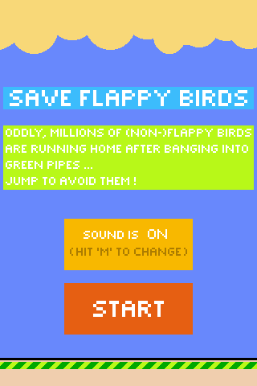
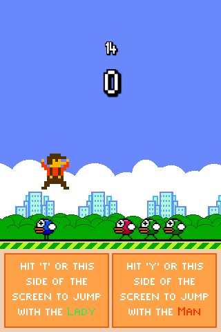
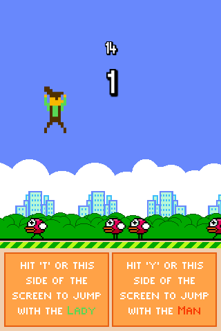

#Save Flappy Birds

##Description

This game was made in a week with [Phaser](http://phaser.io/) for the [Flappy Jam](http://itch.io/jam/flappyjam).

Save Flappy Birds is simple : you just have to *jump over the running flappy birds* to make the highest score you can.
The *originality and difficulty* concsist of the possibility to *swap between a heavy and a light character*.

**Even if it's easy to learn, the swap makes it difficult to master**.

##Controls

You can play either :
- with a keyboard : T to jump with the Lady, Y with the Man (and M to mute)
- with a mouse : click on the Left to jump with the Lady, on the Right with the Man
- on a touchscreen : same as with a mouse
The controls both allow to jump and swap characters. Be careful, the latter haven't got the same weight !

##Screenshots

*In game, jumping with the heavy man :*

*In game, jumping with the light lady :*

##Thanks

I would like to thank :
- for the framework used : the amazing [Phaser](http://phaser.io/) by [Richard Davey](https://twitter.com/photonstorm)
- for the sound effects : the very useful [sfxr](http://www.drpetter.se/project_sfxr.html) by DrPetter
- for the music : the incredible tool [Bosca Ceoil](http://distractionware.com/blog/2013/08/bosca-ceoil/) by [Terry Cavanagh](https://twitter.com/terrycavanagh)

##About the game

Save Flappy Birds is a *HTML5 game* made by me ([Aurélien Picolet](https://twitter.com/AurelienPicolet))in February 2014.
You can find it on my portfolio at [http://aurelienpicolet.com/](http://aurelienpicolet.com/) or on itch.io at [http://aurelien974.itch.io/save-flappy-birds](http://aurelien974.itch.io/save-flappy-birds).

